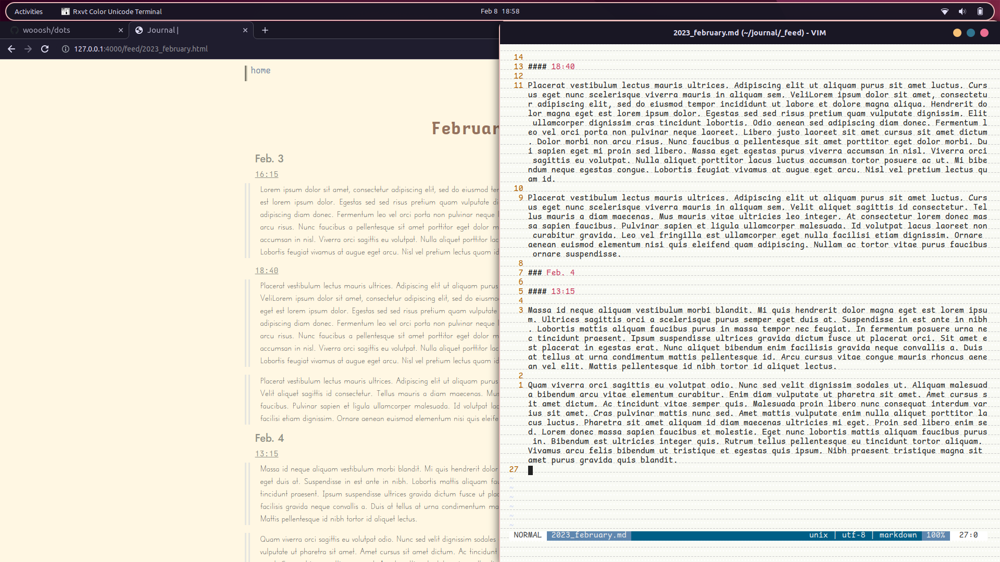

# Journal Template

Just the template for the journal I use. It uses jekyll to generate a website and the files in `_feed` become entries thereof. I don't post the actual entries here but it's a pretty fun theme-based project.

To use it just set up jekyll, clone the project, and run `bundle exec jekyll serve --livereload`. All the entries are put in the `journal/_feed` directory. Could've had them put in `journal/_posts` but I was troubleshooting something and when I shifted over to another collection I couldn't be bothered to change it back.

## Screenshots

### Home Page

All entries will show up here as a list of links to those pages.

### Entry Page

Pretty much what your page will look like. I really like the No Tears font because I think it's a well designed handwriting font (credits at the bottom) but you can change it to whatever you want to in `css/style.css`.

### Fluff

If you would like something a little more at home, you can get your terminal to look something like a notepad (credits at the bottom) with a kitty config located at `extra/kitty`. Just drop the folder into your `~/.config` directory and the next instance of kitty you launch should look something like a notebook.

If you're more of a URxvt person I have the config set up for that as well in `journal/extra/.Xresources`. Just go to where that file is, make the change to the path of the tiled-background image, and run `xrdb -m .Xresources`.

## Credits

Thanks for checking out my GitHub, hope you were entertained. Most of the fonts in this come from Owen Earl, you can check out his fonts over at [indestructible type*](https://indestructibletype.com/Home.html). I really love all the fonts he puts out, especially those from the Jost* font family, which was the original font used for this but I eventually opted for No Tears* as this seemed like the best time to use it.

The idea for the terminal notepad theme and the image that it tiles for the notebook lines comes from [wooosh](https://github.com/wooosh/dots) and it uses the [rose-pine](https://github.com/rose-pine/rose-pine-theme) theme.
